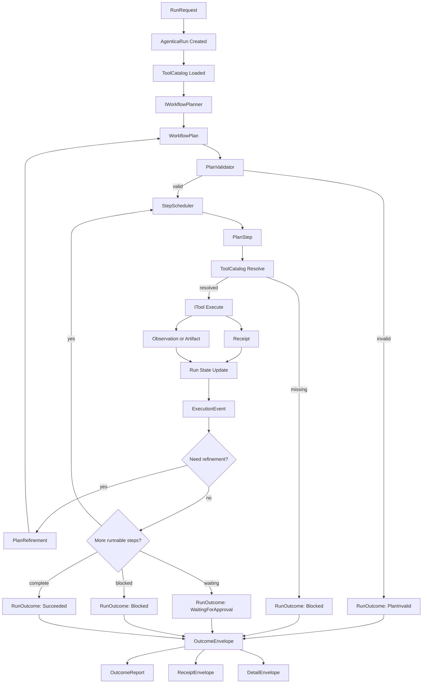
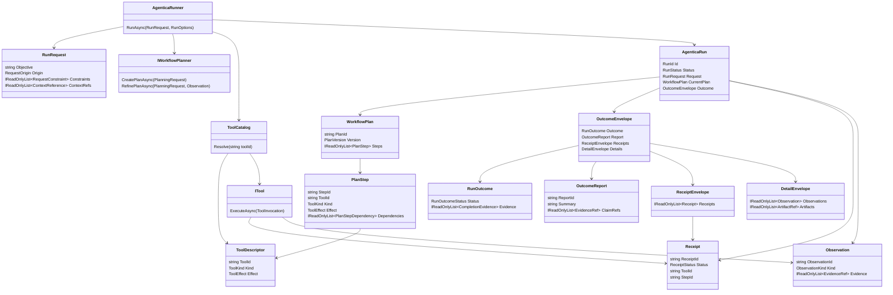

# Agentica Object Graph

This document describes Agentica as a planner/executor package. It is not a storage design and it is not a proposal for many projects.

The central idea is:

```text
RunRequest -> WorkflowPlan -> query/read tools -> observations -> plan refinement -> action tools -> receipts -> OutcomeEnvelope
```

`RunRequest` replaces the narrower `UserPrompt` concept. A request can originate from a person, another agent, a host process, a scheduled job, or a test fixture.

`AgenticaRun` replaces the vague `AgenticaExecution` concept. A run is the bounded runtime object that carries the request, plan versions, step states, observations, artifacts, receipts, events, and final outcome.

Agentica is the reusable reason-and-execute workflow handler. The host application owns the domain and provides state, policy, tools, approvals, and optional recording. Agentica owns the loop that plans, executes, observes, refines, and reports under those host-provided contracts.

Package-first is intentional. A microservice wrapper can host Agentica later, but the object model should not be shaped around transport, queues, auth, deployment, or database concerns.

## Host Boundary

Host applications provide:

- `ToolCatalog` content.
- `ITool` implementations.
- State/data query behavior.
- Action/mutation behavior.
- Domain policy and effect rules.
- Approval hooks.
- Optional event or run recording.
- User-facing voice and presentation.

Agentica provides:

- `RunRequest` and run lifecycle.
- `WorkflowPlan` and plan refinement.
- Tool contract validation.
- Step scheduling and execution.
- Observation, artifact, and receipt normalization.
- Blocker and stop-reason handling.
- Outcome envelope and generated outcome report.

The planner may choose, sequence, and adapt. The runtime still enforces legality, effect boundaries, approval state, receipts, and loop limits.

## Project And Namespace Rule

Target solution shape:

```text
Agentica.slnx
  Agentica/                  primary planner/executor runtime package
  Agentica.CLI/              console host
  Agentica.Clients/          provider SDK isolation for LLM integrations
```

Avoid these project splits unless a real dependency or packaging problem appears:

```text
Agentica.Core
Agentica.Abstractions
Agentica.Contracts
Agentica.Runtime
Agentica.Storage
Agentica.Persistence
Agentica.Tools
Agentica.Events
```

Use namespaces inside `Agentica`:

```text
Agentica
Agentica.Requests
Agentica.Runs
Agentica.Planning
Agentica.Tools
Agentica.Execution
Agentica.Observations
Agentica.Artifacts
Agentica.Events
Agentica.Validation
Agentica.Outcomes
```

No `Agentica.Storage` namespace is needed for the first package shape. When recording becomes necessary, prefer an adapter-shaped port such as `Agentica.Events.IEventSink` or a later `Agentica.Recording` namespace. The runtime must not be designed around a database.

## Cognition Lessons Applied

The older `cognition` repo proves that the core planner/executor idea is viable, but also shows how quickly it can disappear into application infrastructure. Its reusable kernel was roughly:

```text
PlannerContext
  -> PlannerMetadata
  -> PlannerResult
  -> PlannerStepRecord
  -> artifacts/diagnostics/follow-up work
  -> ToolDescriptor policy/effect metadata
```

Agentica should keep that kernel and remove the coupling.

Do not repeat these `cognition` choices in Agentica:

- Do not split the runtime into API, Jobs, Clients, Contracts, Data, Domains, Workflows, and Relational projects just to express conceptual boundaries.
- Do not put planner runtime contracts under an LLM/client namespace.
- Do not make EF entities, migrations, dashboards, queues, or transcripts mandatory for the runtime model.
- Do not let controllers, jobs, or host services become the real workflow engine.
- Do not introduce dynamic tool foundry, sandbox worker, registry publishing, or scope hashing in the first slices.
- Do not make quota systems, token accounting, metrics dashboards, or rate-limit economics part of the core run domain.
- Do not let fiction/book/domain vocabulary leak into the generic execution model.

Harvest these `cognition` ideas instead:

- `PlannerContext` maps to `PlanningRequest` plus `StepExecutionContext`.
- `PlannerMetadata` maps to `ToolDescriptor` and planner capability metadata.
- `PlannerResult` maps to `PlanningResult`, `Observation`, `Artifact`, `Receipt`, and `OutcomeEnvelope`.
- `PlannerStepRecord` maps to `PlanStep` plus `ExecutionEvent`.
- Template existence checks map to plan validation and model-output validation.
- Cancellation and hard stop limits map to `ExecutionPolicy`.
- Transcripts, telemetry, quotas, token usage, and metrics map to tools, plugins, event sinks, policy hooks, or optional recorders.

The important distinction: `cognition` stored and operated an app; Agentica describes and executes a workflow. Storage, dashboards, queues, and services are host concerns until a concrete adapter becomes necessary.

## Directory Plan

```text
Agentica/
  Requests/
    RunRequest.cs
    RequestOrigin.cs
    RequestConstraint.cs
    ContextReference.cs

  Runs/
    AgenticaRun.cs
    RunId.cs
    RunOptions.cs
    RunSnapshot.cs
    RunStatus.cs
    StepStatus.cs

  Planning/
    WorkflowPlan.cs
    PlanStep.cs
    PlanStepDependency.cs
    PlanStepInput.cs
    PlanStepOutputContract.cs
    PlanVersion.cs
    PlanRefinement.cs
    PlanRefinementReason.cs
    IWorkflowPlanner.cs
    PlanningRequest.cs
    PlanningContextOptions.cs
    PlanningResult.cs

  Tools/
    ToolCatalog.cs
    ToolDescriptor.cs
    ToolEffect.cs
    ToolKind.cs
    ToolInputSchema.cs
    ToolInputField.cs
    ToolInputValueType.cs
    ToolOutputContract.cs
    ToolInvocation.cs
    ToolResult.cs
    ITool.cs

  Execution/
    AgenticaRunner.cs
    ExecutionPolicy.cs
    PlanningMode.cs
    ToolEffectPolicy.cs
    ICompletionEvaluator.cs
    CompletionEvaluation.cs
    CompletionDecision.cs
    EvidenceCompletionEvaluator.cs
    PlanExhaustionCompletionEvaluator.cs
    ExecutionLoop.cs
    StepScheduler.cs
    StepExecutionContext.cs
    StepExecutionResult.cs
    ContinuationDecision.cs
    StopReason.cs

  Observations/
    Observation.cs
    ObservationKind.cs
    EvidenceRef.cs
    StateQueryResult.cs

  Artifacts/
    Artifact.cs
    ArtifactRef.cs
    ArtifactKind.cs
    ArtifactPayload.cs
    Receipt.cs
    ReceiptStatus.cs

  Events/
    ExecutionEvent.cs
    ExecutionEventType.cs
    IEventSink.cs
    ConsoleEventSink.cs
    InMemoryEventSink.cs

  Validation/
    IPlanValidator.cs
    PlanValidationResult.cs
    ValidationIssue.cs
    ToolContractValidator.cs

  Outcomes/
    OutcomeEnvelope.cs
    OutcomeReport.cs
    IOutcomeReporter.cs
    ReceiptEnvelope.cs
    DetailEnvelope.cs
    RunOutcome.cs
    RunOutcomeStatus.cs
    CompletionEvidence.cs
```

Provider/client project:

```text
Agentica.Clients/
  Llm/
    ILlmClient.cs
    LlmRequest.cs
    LlmResponse.cs
    LlmThinkingOptions.cs

  Gemini/
    GeminiLlmClient.cs
    GeminiClientOptions.cs
    GeminiThinkingOptionsMapper.cs

  Planning/
    LlmWorkflowPlanner.cs
    WorkflowPlanPromptBuilder.cs
    WorkflowPlanJsonContract.cs
```

The client project adapts provider responses into Agentica contracts. It does not define plans, steps, tools, receipts, observations, or run outcomes. `Agentica.Clients` may reference `Agentica`; `Agentica` must not reference `Agentica.Clients`.

LLM-backed outcome reporting can live behind `IOutcomeReporter` in the Agentica runtime package and use `Agentica.Clients` as an implementation dependency later. The runtime contract remains `OutcomeReport`; provider-specific response types must not leak into it.

## Core Object Responsibilities

### Requests

`RunRequest`
: Starts a workflow run. Contains objective, origin, constraints, context refs, desired outcome, and optional requester metadata.

`RequestOrigin`
: Identifies where the request came from: `User`, `Agent`, `Scheduler`, `Host`, `Test`, or `System`.

`RequestConstraint`
: A bounded instruction such as time budget, approval requirement, allowed tools, disallowed effects, or stop condition.

`ContextReference`
: A reference to host-provided state or data. Agentica carries refs and shape; the host resolves the actual data.

### Runs

`AgenticaRun`
: Aggregate for one bounded workflow. Owns request, current plan version, step states, observations, artifacts, receipts, events, and outcome.

`RunSnapshot`
: Immutable view of the current run for event display, inspection, and testing.

`RunStatus`
: `Created`, `Planning`, `PlanInvalid`, `Running`, `RefiningPlan`, `WaitingForApproval`, `Blocked`, `Failed`, `Succeeded`, `Cancelled`, `PartiallyComplete`.

### Planning

`IWorkflowPlanner`
: Asynchronously produces an initial `WorkflowPlan` or a refined plan after an observation. The implementation may be deterministic, model-backed, or host-provided.

`PlanningRequest`
: Run request, tool catalog, current observations, prior artifacts, prior receipts, and policy limits.

`PlanningContextOptions`
: Bounds the planner-visible history of observations and receipts. Full run details remain in `DetailEnvelope`; planner context shaping controls what is fed back into the next planning call.

`WorkflowPlan`
: Versioned plan contract. Contains steps, dependency edges, allowed refinement points, expected observations, expected receipts, and completion conditions.

`PlanStep`
: One unit of planned work. A step may be a query/read step, action step, reasoning/planning step, validation step, or outcome step.

`PlanStepInput`
: Input refs and literal values for a step.

`PlanStepOutputContract`
: Declares whether the step should produce an observation, artifact, receipt, event, or outcome contribution.

`PlanRefinement`
: Explicit plan update caused by observations, blockers, failures, approvals, or changed preconditions.

### Tools

`ToolCatalog`
: The planner-visible set of current tools. A catalog can change between runs and can be scoped by host policy.

`ToolDescriptor`
: Tool id, name, kind, effect level, input schema, approval requirements, and description.

`ToolInputSchema`
: Compact input contract for a tool. It describes named fields, required inputs, allowed values, examples, and basic type/range constraints.

`ToolInputField`
: One named input field in a tool schema.

`ToolInputValueType`
: Generic input type: `Any`, `String`, `Integer`, `Number`, `Boolean`, `Object`, or `Array`.

`ToolKind`
: `Query`, `Action`, `PlannerAssist`, `Validation`, `Synthesis`.

`ToolEffect`
: `ReadOnly`, `WritesLocalState`, `ExternalSideEffect`, `Destructive`, `Unknown`.

`ITool`
: Host-implemented executor for one tool. Agentica calls tools through this boundary and treats results as untrusted until normalized.

`ToolInvocation`
: Concrete invocation with step id, tool id, input payload, context refs, and correlation ids.

`ToolResult`
: Raw tool return value before Agentica converts it into observations, artifacts, and receipts.

### Observations

`Observation`
: Structured information learned from query/read tools or validation tools. Observations can drive plan refinement.

`StateQueryResult`
: A specific observation from a read/query tool. It describes what was asked, what was found, freshness, confidence, and evidence refs.

`EvidenceRef`
: Reference to a receipt, artifact, tool result, host object, or prior observation.

### Artifacts And Receipts

`Artifact`
: Typed output that later steps may consume. Artifacts are not proof by themselves unless linked to receipts.

`ArtifactRef`
: Stable reference to an artifact in the run.

`Receipt`
: Proof that a tool accepted, refused, executed, failed, timed out, paused, or returned output.

`ReceiptStatus`
: `Accepted`, `Refused`, `Succeeded`, `Failed`, `Partial`, `WaitingForApproval`, `Unavailable`, `TimedOut`, `Cancelled`.

### Execution

`AgenticaRunner`
: Coordinates the run. It asks for a plan, validates it, schedules steps, executes tools, records observations and receipts, requests refinements, emits events, and returns an `OutcomeEnvelope`.

`ExecutionPolicy`
: Runtime limits and safety rules: max steps, max refinements, max plan continuations, max blocked retries, timeout, planning mode, effect policy, planner context shaping, approval behavior, and terminal status rules.

`RunAttemptSummary`
: Compact summary of each top-level attempt when `AgenticaRunner` starts blocked retries. The final envelope keeps the final attempt details and includes attempt summaries under `DetailEnvelope.RunAttempts`.

`PlanningMode`
: Refinement cadence: `Stepwise`, `QueryAndBlockerDriven`, `BlockerDriven`, or `PlanOnly`. Planning mode decides when observations trigger plan refinement; it does not grant authority to skip validation or invent success.

`ToolEffectPolicy`
: Generic gate for allowed tool effects. Hosts can allow local writes while blocking external side effects or destructive actions.

`ICompletionEvaluator`
: Host-selectable completion gate. It decides whether plan exhaustion means complete, continue, blocked, or partial based on run evidence.

`CompletionEvaluation`
: The result of evaluating completion: decision, stop reason, and blockers.

`EvidenceCompletionEvaluator`
: Generic evaluator that can require evidence such as a specific artifact kind or successful receipt tool before success is allowed.

`StepScheduler`
: Chooses the next runnable step from the current plan and run state.

`ContinuationDecision`
: Decides whether to continue, refine plan, wait for approval, stop blocked, fail, or complete.

`StopReason`
: Machine-readable explanation for why the run stopped.

### Events

`ExecutionEvent`
: Operator-visible event. Events are the console and UI surface for the run.

`IEventSink`
: Receives events. Console and test implementations belong in the first slice. A database-backed event recorder can come later without changing the runtime model.

### Outcomes

`OutcomeEnvelope`
: The complete terminal package returned by Agentica. It contains the machine-readable outcome, generated report, receipt envelope, detail envelope, and completion evidence.

`OutcomeReport`
: LLM-generated report over the run. It describes what was requested, what was planned, what tools ran, what completed, what blocked or failed, what remains unknown, and recommended next actions. It is designed for another system or model to summarize, restate, or render in a different voice.

`IOutcomeReporter`
: Produces an `OutcomeReport` from the final run snapshot, receipts, observations, artifacts, and stop reason. The first implementation can be deterministic; a later implementation can be LLM-backed.

`ReceiptEnvelope`
: Machine-readable collection of all receipts relevant to the terminal outcome, grouped by step, tool, status, and evidence role.

`DetailEnvelope`
: Full structured terminal detail: request, plan versions, plan refinements, step results, observations, artifact refs, event refs, blockers, and validation issues.

`RunOutcome`
: Machine-readable terminal status for the run. It summarizes status, stop reason, completed steps, remaining blockers, receipt refs, artifacts, and completion evidence.

`CompletionEvidence`
: The specific receipts and artifacts that justify success or partial success.

Outcome report rule:

- The report is not proof of execution.
- The report must cite the receipt, observation, artifact, validation issue, or stop reason behind each important claim.
- The report should be useful to downstream systems that need to summarize it, restate it in another voice, or decide what to do next.

## Runtime Execution Graph



## Object Relationship Graph



## First Implementation Set

Start with these only:

```text
Requests/
  RunRequest
  RequestOrigin

Runs/
  AgenticaRun
  RunStatus
  RunOptions

Planning/
  WorkflowPlan
  PlanStep
  IWorkflowPlanner
  PlanningRequest
  PlanningResult

Tools/
  ToolCatalog
  ToolDescriptor
  ToolKind
  ToolEffect
  ToolInputSchema
  ToolInputField
  ToolInputValueType
  ITool
  ToolInvocation
  ToolResult

Observations/
  Observation

Artifacts/
  Receipt
  ReceiptStatus

Events/
  ExecutionEvent
  ExecutionEventType
  IEventSink

Execution/
  AgenticaRunner
  ExecutionPolicy
  PlanningMode
  ToolEffectPolicy
  ICompletionEvaluator
  CompletionEvaluation

Outcomes/
  OutcomeEnvelope
  OutcomeReport
  IOutcomeReporter
  ReceiptEnvelope
  DetailEnvelope
  RunOutcome
```

Implemented in the first executable and LLM planning slices:

```text
PlanRefinement
Agentica.Clients
LlmWorkflowPlanner
GeminiLlmClient
WorkflowPlannerException
```

Delay these until the loop and LLM planner harden:

```text
PlanStepDependency
PlanVersion
StateQueryResult
CompletionEvidence
LLM-backed OutcomeReport generation
Any database-backed recorder
MCP hosting or MCP tool adapters
```

## Naming Decisions

`UserPrompt`
: Too narrow. Replace with `RunRequest`.

`AgenticaExecution`
: Too vague and awkward. Replace with `AgenticaRun`.

`ExecutionPlan`
: Acceptable, but `WorkflowPlan` better matches the package goal because the plan contains query steps, refinement points, and action steps.

`Tool`
: Keep. It is the right generic boundary for query/read and action/mutation capabilities.

`Storage` or `Persistence`
: Do not use as a core namespace or project. Use event sinks and optional recording adapters later.

## Boundary Tests

The first real tests should prove:

- A request from origin `Agent` is valid.
- A request from origin `User` is valid.
- A plan can include a read/query tool before an action tool.
- Unknown tools fail before execution.
- A query observation can trigger a plan refinement.
- A mutation-capable tool cannot be executed without a matching descriptor and receipt.
- A run can stop blocked without synthesizing false completion.
- A generated outcome report cites receipt, observation, artifact, or stop-reason refs for important claims.
- A downstream system can consume the outcome envelope without parsing console text.
